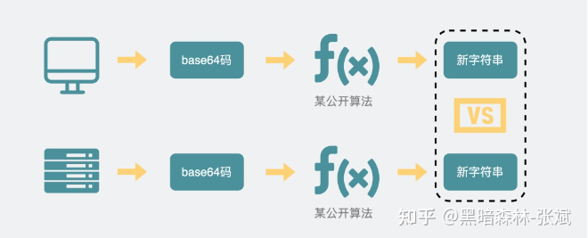
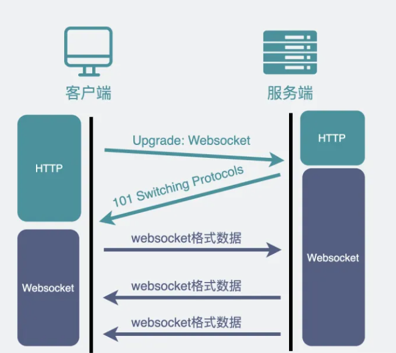

## HTTP 和 Websocket 长连接

> [参考博客](https://zhuanlan.zhihu.com/p/590817258)

### HTTP
前端发一次HTTP请求，网站返回一次HTTP响应，但这种情况下，服务器**不会主动**给客户端发消息，为了解决用户不做任何操作的情况下，网页能接收到消息并发生变更，可以**使用HTTP不断轮询**或者**长轮询**

HTTP不断轮询：网页的前端代码不断定时发HTTP请求到服务器，服务器收到请求后给客户端响应消息。（场景：扫码登录）问题就是：F12界面会占满屏的HTTP请求，会消耗带宽以及增加下游服务器的负担；以及用户体验上扫码确认成功后，可能会等1~2s，才触发下一次HTTP请求后再跳转页面，会感到明显卡顿。

长轮询：发起一个请求，在较长时间内等待服务器响应的机制，比如扫码登录，把HTTP请求的超时限制延长（如30s），超时后立马发起下一次请求

这两种解决方案，本质上还是客户端主动去取数据

### Websocket

**TCP**连接的两端，同一时间里双方都可以**主动**向对方发送数据==>**全双工**；HTTP基于TCP协议，但是设计之初考虑的是网页文本的场景，只做到客户端发齐请求再由服务器响应==>**半双工**

基于TCP的新协议==>**Websocket**，例如网页游戏，聊天，服务器和客户端需要频繁交互的场景。

浏览器在**TCP三次握手**建立连接之后，都**统一使用HTTP协议**先进行一次通信。

- 如果此时是**普通的HTTP请求**，那后续双方就还是老样子继续用普通HTTP协议进行交互，这点没啥疑问。
- 如果这时候是**想建立websocket连接**，就会在HTTP请求里带上一些**特殊的header头**。

 ```js
 Connection: Upgrade // 升级协议成websocket
 Upgrade: websocket
 Sec-WebSocket-Key: T2a6wZlAwhgQNqruZ2YUyg==\r\n // 随机生成的base64码发给服务器
 ```

如果服务器支持，走websocket握手流程，把客户端生成的base64码经过公开算法响应101状态码（指协议切换）给客户端，之后，浏览器也用同样的**公开算法**将`base64码`转成另一段字符串，如果这段字符串跟服务器传回来的**字符串一致**，那验证通过

```js
HTTP/1.1 101 Switching Protocols\r\n
Sec-WebSocket-Accept: iBJKv/ALIW2DobfoA4dmr3JHBCY=\r\n
Upgrade: websocket\r\n
Connection: Upgrade\r\n
```



经历了一来一回两次HTTP握手，websocket就建立完成了，后续双方就可以使用webscoket的数据格式进行通信了



总之就是，websocket和HTTP一样都是基于TCP的协议。经历了三次TCP握手之后，利用HTTP协议升级为websocket协议建立连接。

**代码中建立websocket**

```js
const socket = new WebSocket('ws://localhost:8080');
// socket有url,open,close,error,send等属性和方法
```

### 总结

- TCP协议本身是**全双工**的，但我们最常用的HTTP1.1，虽然是基于TCP的协议，但它是**半双工**的，对于大部分需要服务器主动推送数据到客户端的场景，都不太友好，因此我们需要使用支持全双工的websocket协议。
- 在HTTP1.1里。只要客户端不问，服务端就不答。基于这样的特点，对于登录页面这样的简单场景，可以使用**定时轮询或者长轮询**的方式实现**服务器推送**(comet)的效果。
- 对于客户端和服务端之间需要频繁交互的复杂场景，比如网页游戏，都可以考虑使用websocket协议。
- websocket和socket几乎没有任何关系，只是叫法相似。
- 正因为各个浏览器都支持HTTP协议，所以websocket会先利用HTTP协议加上一些特殊的header头进行握手升级操作，升级成功后就跟HTTP没有任何关系了，之后就用websocket的数据格式进行收发数据。
- websocket没有同源限制，因为websocket使用类似ws://这样的方式进行连接，并不是使用http协议进行数据传输。所以浏览器的SOP无法限制它。而且websocket本来就是设计成支持跨域访问的协议的。在websocket请求的请求头中会像cors一样加入origin字段，服务端可以根据这个字段来判断是否通过该请求
