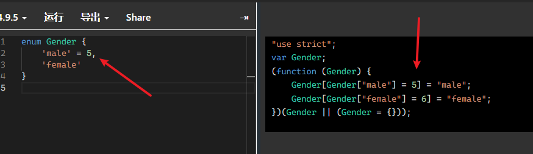

## TypeScript

>  参考文章：[TypeScript入门教程](https://ts.xcatliu.com/)

是一个提高代码可维护性和调试效率的强类型语言，TypeScript 的主要作用是给 JavaScript 赋予强类型的语言环境。在完整保留 JavaScript 运行时行为的基础上（允许运行时进行隐式类型转换如简单运算），通过引入静态类型系统来提高代码的可维护性，减少可能出现的 bug

### 定义基础数据类型

**对变量的数据类型加以限制**

```tsx
let courseName:string = '111'
let price:number = 123
let isB:boolean = true
let me:[string,number] = ['211', 1]
```

当不确定某个变量是什么类型时，用 **any** 类型；**void**的类型表示没有任何类型，对于函数来说表示没有返回值，对于变量来说，只能赋予它为undefined和null；而**undefined**和**null**是所有类型的子类型，也就是说**undefined**类型的变量，可以赋值给**number**类型的变量

```tsx
// 这样不会报错
let num: number = undefined;
// 这样也不会报错
let u: undefined;
let num: number = u;

//报错
let u: void;
let num: number = u;
```

Typescript可以类型推论：会在没有明确的指定类型的时候推测出一个类型

```tsx
let myFavoriteNumber = 'seven';
myFavoriteNumber = 7; //报错

let myFavoriteNumber;
myFavoriteNumber = 'seven';
myFavoriteNumber = 7; // 不报错 因为在定义的时候没有赋值，被推断成any类型了
```

### enum 枚举

- 默认枚举 — 数字枚举

定义一个Gender枚举类，将这些属性都默认定义成了数字，默认是从`0`开始，支持正反映射（通过属性值反向取到属性名）

```tsx
enum Gender {
    'male',
    'female'
}
// 转义成js
"use strict";
var Gender;
(function (Gender) {
    Gender[Gender["male"] = 0] = "male";
    Gender[Gender["female"] = 1] = "female";
})(Gender || (Gender = {}));

// 正反映射
let gender = Gender.male // 取到0
let gender1 = Gender[0] // 取到male
```

也可以自定义数字，如果只定义第一个，后面的数字就依据你定义的递增

（定义不同的数字 后面的数字会覆盖前面的来递增）



- 自定义枚举 — 字符串枚举，不支持正反映射（看下方js转义）

```tsx
enum Gender {
    'male' = "this is male",
    'female' = 'this is female'
}
// 转义成js
"use strict";
var Gender;
(function (Gender) {
    Gender["male"] = "this is male";
    Gender["female"] = "this is female";
})(Gender || (Gender = {}));
```

混合定义 — 异构枚举

```tsx
enum Gender {
    'male' = "this is male",
    'female' = 1
}
// 转义成js
"use strict";
var Gender;
(function (Gender) {
    Gender["male"] = "this is male";
    Gender[Gender["female"] = 1] = "female";
})(Gender || (Gender = {}));
```

- 常量枚举 — const，不支持正反映射，枚举定义会在编译阶段被删除，并且不能包含计算成员

```tsx
const enum Gender {
    'male',
    'female'
}
let gender = Gender.male
// 转义成js
"use strict";
let gender = 0 /* Gender.male */;
```

### 联合类型 |

```tsx
let course:string|number = '100'
course = 100

type course = '100' | 100 | '90'
let score:course = '100'
let score1:course = '80' // 报错
```

### interface 接口

定义对象的类型限制，number[] 语法定义类型为数字组成的数组，? 设置为可选属性，readonly 设置为只读属性

```tsx
interface Project { //接口一般首字母大写
    name: string,
    price: number[],
    icon?: string|boolean,
    readonly path: string,
    [propName: string]: any; // 允许有任意的属性，确定属性和可选属性的类型都必须是它的类型的子集
}
let test:project = {
    name: 'test',
    price: [60,80],
    icon: true,
    path: '/111'
}
test.path = '/222' //报错
```

**接口继承接口**

```tsx
interface Alarm {
    alert(): void;
}

interface LightableAlarm extends Alarm {
    lightOn(): void;
    lightOff(): void;
}
```

**接口继承类**

```tsx
class Point {
    x: number;
    y: number;
    constructor(x: number, y: number) {
        this.x = x;
        this.y = y;
    }
}

interface Point3d extends Point {
    z: number;
}

let point3d: Point3d = {x: 1, y: 2, z: 3};
```

### 数组类型

- 类型 + [] 表示法 例如 number[] 表示数组的项中只允许出现number类型
- 泛型 Array<类型> 例如`Array<number>`
- 接口 （一般不会这么做，比较复杂）

```tsx
interface NumberArray {
    [index: number]: number; // 只要索引的类型是数字时，那么值的类型必须是数字
}
let fibonacci: NumberArray = [1, 1, 2, 3, 5];
```

当数组里合并了不同的类型时 叫做**元组**

### 函数类型

对其进行约束，需要把输入和输出都考虑到

```tsx
// 函数声明
function sum(x: number, y: number): number {
    return x + y;
}
sum(1+2)
sum(1) //报错 不允许参数输多或输少 可用可选参数

// 函数表达式  注意不要混淆了 TypeScript 中的 => 和 ES6 中的 =>
let mySum: (x: number, y: number) => number = function (x: number, y: number): number {
    return x + y;
};
```

使用接口的方式来定义一个函数需要符合的形状：

```tsx
interface SearchFunc {
    (source: string, subString: string): boolean;
}

let mySearch: SearchFunc;
mySearch = function(source: string, subString: string) {
    return source.search(subString) !== -1;
}
```

**可选参数**? 必须接在必需参数后面

```ts
function sum(x: number, y?: number): number {
    return x + y;
}
```

**参数默认值**

```tsx
function sum(x: number, y: number = 1): number {
    return x + y;
}
```

**剩余参数**

ES6 中，可以使用 `...rest` 的方式获取函数中的剩余参数（rest 参数）

```tsx
//items是一个数组 接收可选参数
function push(array: any[], ...items: any[]) {
    items.forEach(function(item) {
        array.push(item);
    });
}

let a = [];
push(a, 1, 2, 3);
```

rest参数只能是最后一个参数

**重载**

允许一个函数接受不同数量或类型的参数时，作出不同的处理

```tsx
// 使用联合类型 不够精确的表达
function reverse(x: number | string): number | string | void {
    if (typeof x === 'number') {
        return Number(x.toString().split('').reverse().join(''));
    } else if (typeof x === 'string') {
        return x.split('').reverse().join('');
    }
}

// 重载 重复定义了多次函数reverse 前几次是函数定义 最后一次是函数实现
function reverse(x: number): number;
function reverse(x: string): string;
function reverse(x: number | string): number | string | void {
    if (typeof x === 'number') {
        return Number(x.toString().split('').reverse().join(''));
    } else if (typeof x === 'string') {
        return x.split('').reverse().join('');
    }
}
```

### 类型断言

`值 as 类型` 或者 `<类型>值` （在 tsx 语法中必须使用前者）

- 将一个联合类型断言为其中的一个类型 （解决之前用联合类型 只能访问所有类型中共有的属性或方法）

```tsx
interface Cat {
    name: string;
    run(): void;
}
interface Fish {
    name: string;
    swim(): void;
}

function isFish(animal: Cat | Fish) {
    if (typeof (animal as Fish).swim === 'function') {
        return true;
    }
    return false;
}
```

- 将一个父类断言为更加具体的子类

```tsx
interface ApiError extends Error {
    code: number;
}
interface HttpError extends Error {
    statusCode: number;
}

function isApiError(error: Error) {
    // 此处不适宜用intanceof来判断 因为上述定义的接口类型在编译结果中会被删除 就无法使用intanceof来做运行时判断
    if (typeof (error as ApiError).code === 'number') {
        return true;
    }
    return false;
}
```

- 将任何一个类型断言为 `any`
- 将`any`断言为一个具体的类型
- 要使得 `A` 能够被断言为 `B`，只需要 `A` 兼容 `B` 或 `B` 兼容 `A` 即可

### 泛型

指在定义函数、接口或类的时候，不预先指定具体的类型，而在使用的时候再指定类型的一种特性。

```tsx
function createArray<T>(length: number, value: T): Array<T> {
    let result: T[] = [];
    for (let i = 0; i < length; i++) {
        result[i] = value;
    }
    return result;
}
createArray<string>(3, 'x'); // ['x', 'x', 'x']
```

在函数名后添加了 `<T>`，其中 `T` 用来指代任意输入的类型，在后面的输入 `value: T` 和输出 `Array<T>` 中即可使用了

**多个类型参数**

```tsx
function swap<T, U>(tuple: [T, U]): [U, T] {
    return [tuple[1], tuple[0]];
}

swap([7, 'seven']); // ['seven', 7]
```

**泛型约束**

在函数内部使用泛型变量的时候，由于事先不知道它是哪种类型，所以不能随意的操作它的属性或方法：

```tsx
function loggingIdentity<T>(arg: T): T {
    console.log(arg.length);
    return arg;
}
// index.ts(2,19): error TS2339: Property 'length' does not exist on type 'T'.

interface Lengthwise {
    length: number;
}
// 只允许这个函数传入那些包含length属性的变量
function loggingIdentity<T extends Lengthwise>(arg: T): T {
    console.log(arg.length);
    return arg;
}
```

### 声明合并

- 函数的合并 — 重载
- 接口的合并 **合并的属性的类型必须是唯一**

```tsx
interface Alarm {
    price: number;
}
interface Alarm {
    weight: number;
}
// 相当于
interface Alarm {
    price: number;
    weight: number;
}
```

### keyof

获取某个类型 / 对象的**属性名**来构成新的联合类型

格式：

1. `type 类型 = keyof 类型`
2. `type 类型 = keyof 对象常量`

示例：

```ts
{
    // ◆ 第一种：获取某个类型的属性名构成新的类型
    type Point = { x: number; y: number }
    type P = keyof Point
    let p1: P = 'y'
    let p2: P = 'x'
    // ◆ 第二种:获取某个对象的属性名构成新的类型
    type T = keyof { a: 1, b: 2 }
    let keyName: T = 'b'
}
```

`keyof any` 返回的是一个联合类型：`string | number | symbol`

`in`的右侧一般会跟一个联合类型，使用`in`操作符可以对该联合类型进行迭代

```tsx
type Animals = 'pig' | 'cat' | 'dog'

type animals = {
    [key in Animals]: string
}
// type animals = {
//     pig: string; //第一次迭代
//     cat: string; //第二次迭代
//     dog: string; //第三次迭代
// }
```

### infer

> [参考博客](https://juejin.cn/post/7133438765317488677)

TypeScript 可以通过模式匹配的方式，提取一部分类型返回。

在 First of Array 中，我们可以将 Rest 参数放在后面，只需要提取出 First 即可。

```ts
type First<T extends any[]> = T extends [infer first, ...infer rest] ? first : never
```

同理，在 Last of Array 中，我们将 Rest 参数放在前面，取出后面的 Last 参数即可

```ts
type Last<T extends any[]> = T extends [...infer Rest, infer Last] ? Last : never
```

在函数中使用，用来推断出函数传入参数的类型，以及函数返回值的类型

```tsx
type MyParameters<T extends (...args: any[]) => unknown> = T extends (...args: infer P) => unknown ? P : never;

type GetReturnType<Func extends Function> = 
    Func extends (...args: any[]) => infer ReturnType ? ReturnType : never;
```

infer 同样可以推断字符串，也就是字面量类型

比如字符串提取一部分，然后替换：

```tsx
// 提取From 把From替换成To
type ReplaceStr<
    Str extends string,
    From extends string,
    To extends string
> = Str extends `${infer Prefix}${From}${infer Suffix}` 
        ? `${Prefix}${To}${Suffix}` : Str;

type res = ReplaceStr<'hello jack', 'jack', 'bob'>  // type res = "hello bob"
```

