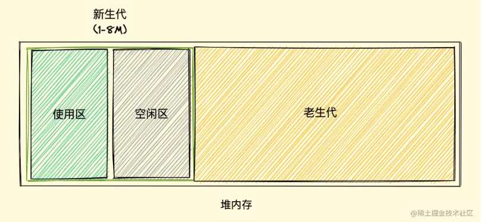

## JS垃圾回收机制

> 参考博客（https://juejin.cn/post/6981588276356317214）

垃圾回收是一种自动的内存资源管理机制，当对象不再被引用到或者不能从根上访问到，就会判定位垃圾

常见的算法：引用计数，标记清除，标记整理，分代回收

### 引用计数

早期用的垃圾回收方法，用一张表保存内存里面所有资源的引用次数，如果一个值的引用次数是0，就表示这个值不再用到了，因此可以将这块内存释放

存在比较大的问题：无法回收**循环引用**的对象（相互引用形成一个环，这样引用计数都不为0，就不会被回收），空间开销比较大（需要单独拿出一片空间去维护每个变量的引用计数）

### 标记清除

1. 从window开始遍历所有对象找**标记**活动对象；
2. 遍历所有对象**清除**没有标记对象；
3. 回收相应的空间。

对比引用计数算法，标记清除算法最大的优点是能够回收循环引用的对象

缺点：会形成空间碎片化，被回收的空间不连续，导致不能被分配

### 标记整理

为了解决内存碎片化的问题，提高对内存的利用，引入了标记整理算法

清除阶段会先执行整理，移动对象位置,将存活的对象移动到一边，然后再清理存活端边界外的内存

缺点：移动对象位置，不会立即回收对象，回收的效率比较慢

### 分代回收

V8 中将堆内存分为**新生代和老生代**两个区域，采用不同的垃圾回收器也就是不同的策略管理垃圾回收。

**新生代**使用复制式的方法，将内存分成使用去和空闲区，新加入的对象都会存放到使用区，当使用区快被写满时，就需要执行一次垃圾清理操作：将使用区的活动对象进行标记，标记完成之后复制进空闲区并且进行排序，随后将使用区非活动对象的空间清理掉，最后进行角色互换，把原来的使用区变成空闲区，把原来的空闲区变成使用区

当一个对象经过多次复制后依然存活，它将会被认为是生命周期较长的对象，或者对象复制后占比内存过大（超过空闲区的25%），都会被移动到老生代中，采用老生代的垃圾回收策略进行管理

**老生代**执行的是标记整理算法

### 性能优化

- 避免使用全局变量
- 减少判断层级
- 减少数据读取次数，对于频繁使用的数据，我们要对数据进行缓存
- 减少循环体中的活动