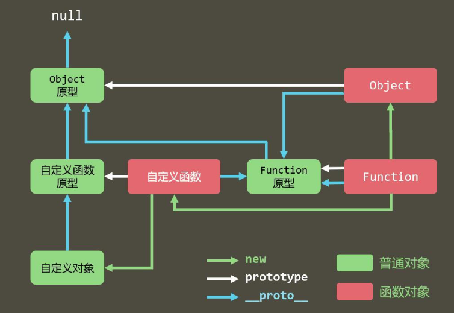

## 原型和原型链

首先明白函数是对象，对象都是通过函数创建的；函数与对象并不是简单的包含与被包含的关系。

### 原型：_proto__和prototype

- 显示原型：prototype，是每个函数function独有的属性。
- 隐式原型： `__proto__`，是每个对象都具有的属性。

JS声明**构造函数**(用来实例化对象的函数)时，会在内存中创建一个对应的对象，这个对象就是原函数的原型。构造函数默认有一个prototype属性，prototype的值指向函数的原型。同时原型中也有一个constructor属性，constructor的值指向函数对象。通过构造函数实例化出来的对象，并不具有prototype属性，其默认有一个__proto__属性，__proto__的值指向构造函数的原型。在原型对象上添加或修改的属性，在所有实例化出的对象上都可共享。

```js
function Person(name) {}
const person = new Person();
console.log(person.__proto__ === Person.prototype); // true
```

**原型的作用：**

- 数据共享 节约内存内存空间
- 实现继承

### 原型链

每个对象都有一个__proto__，它指向它的prototype原型对象；它的prototype原型对象又有一个__proto__指向它的prototype原型对象，就这样层层向上直到最终找到顶级对象Object的prototype，这个查询路径就是原型链。

> 当在实例化的对象中访问一个属性时，首先会在该对象内部(自身属性)寻找，如找不到，则会向其__proto__指向的原型中寻找，如仍找不到，则继续向原型中__proto__指向的上级原型中寻找，直至找到或Object.prototype.__proto__为止（值为null），这种链状过程即为原型链。

原型链的源头是Object！所以万物皆对象呀

Function的隐式原型指向自己的原型

Object原型的隐式原型指向null

**原型链的作用：**查找对象的属性（方法）

