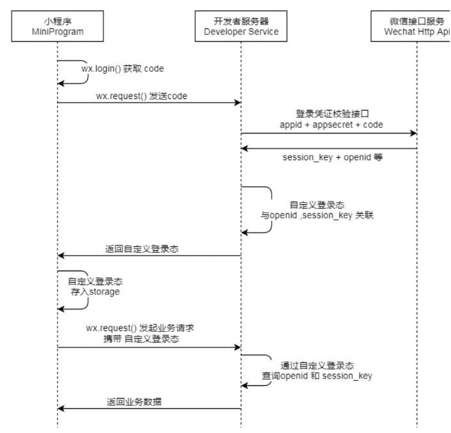
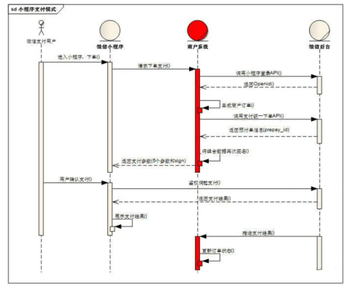
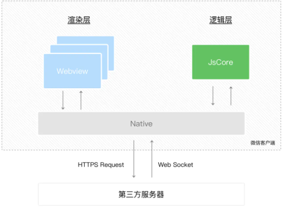

## 小程序

### 对小程序的理解，相比于H5的区别

优点：

- 随搜随用，用完即走：使得小程序可以代替许多APP，或是做APP的整体嫁接，或是作为阉割版功能的承载体
- 流量大，易接受：小程序借助自身平台更加容易引入更多的流量
- 安全
- 开发门槛低
- 降低兼容性限制

缺点：

- 用户留存：及相关数据显示，小程序的平均次日留存在13%左右，但是双周留存骤降到仅有1%
- 体积限制：微信小程序只有2M的大小，这样导致无法开发大型一些的小程序
- 受控微信：比起APP，尤其是安卓版的高自由度，小程序要面对很多来自微信的限制，从功能接口，甚至到类别内容，都要接受微信的管控

**与H5的区别**

- 运⾏环境：⼩程序基于浏览器内核重构的内置解析器
- 系统权限：⼩程序能获得更多的系统权限，如⽹络通信状态、数据缓存能⼒等
- 渲染机制：⼩程序的逻辑层和渲染层是分开的

---

### 小程序的生命周期

**应用的生命周期**

| 生命周期               | 说明                                    |
| ---------------------- | --------------------------------------- |
| onLaunch               | 小程序初始化完成时触发，全局只触发一次  |
| onShow                 | 小程序启动，或从后台进入前台显示时触发  |
| onHide                 | 小程序从前台进入后台时触发              |
| onError                | 小程序发生脚本错误或 API 调用报错时触发 |
| onPageNotFound         | 小程序要打开的页面不存在时触发          |
| onUnhandledRejection() | 小程序有未处理的 Promise 拒绝时触发     |
| onThemeChange          | 系统切换主题时触发                      |

**页面的生命周期**

| 生命周期 | 说明                              | 作用                           |
| -------- | --------------------------------- | ------------------------------ |
| onLoad   | 生命周期回调—监听页面加载         | 发送请求获取数据               |
| onShow   | 生命周期回调—监听页面显示         | 请求数据                       |
| onReady  | 生命周期回调—监听页面初次渲染完成 | 获取页面元素（少用）           |
| onHide   | 生命周期回调—监听页面隐藏         | 终止任务，如定时器或者播放音乐 |
| onUnload | 生命周期回调—监听页面卸载         | 终止任务                       |

**组件的生命周期**

| 生命周期 | 说明                              |
| -------- | --------------------------------- |
| created  | 生命周期回调—监听页面加载         |
| attached | 生命周期回调—监听页面显示         |
| ready    | 生命周期回调—监听页面初次渲染完成 |
| moved    | 生命周期回调—监听页面隐藏         |
| detached | 生命周期回调—监听页面卸载         |
| error    | 每当组件方法抛出错误时执行        |

当存在也应用生命周期和页面周期的时候，相关的执行顺序如下：

- 打开小程序：(App)onLaunch --> (App)onShow --> (Pages)onLoad --> (Pages)onShow --> (pages)onRead
- 进入下一个页面：(Pages)onHide --> (Next)onLoad --> (Next)onShow --> (Next)onReady
- 返回上一个页面：(curr)onUnload --> (pre)onShow
- 离开小程序：(App)onHide
- 再次进入：小程序未销毁 --> (App)onShow(执行上面的顺序），小程序被销毁，（App)onLaunch重新开始执行

---

### 小程序路由跳转，页面栈

- navigateTo 保留当前页面，跳转到应用内的某个页面，使用 wx.navigateBack 可以返回到原页
- redirectTo 关闭当前页面，跳转到应用内的某个页面
- switchTab 跳转到 tabBar 页面，同时关闭其他非 tabBar 页面
- navigateBack 返回上一页面
- reLaunch 关闭所有页面，打开到应用内的某个页面

其中关于它们的页面栈的关系如下：

- navigateTo 新页面入栈
- redirectTo 当前页面出栈，新页面入栈
- navigateBack 页面不断出栈，直到目标返回页，新页面入栈
- switchTab 页面全部出栈，只留下新的 Tab 页面
- reLaunch 页面全部出栈，只留下新的页面

---

### 小程序的登录流程



- 通过 wx.login() 获取到用户的code判断用户是否授权读取用户信息，调用wx.getUserInfo 读取用户数据
- 由于小程序后台授权域名无法授权微信的域名，所以需要自身后端调用微信服务器获取用户信息
- 通过 wx.request() 方法请求业务方服务器，后端把 appid , appsecret 和 code 一起发送到微信服务器。 appid 和 appsecret 都是微信提供的，可以在管理员后台找到
- 微信服务器返回了 openid 及本次登录的会话密钥 session_key
- 后端从数据库中查找 openid ，如果没有查到记录，说明该用户没有注册，如果有记录，则继续往下走
- session_key 是对用户数据进行加密签名的密钥。为了自身应用安全，session_key 不应该在网络上传输
- 然后生成 session并返回给小程序
- 小程序把 session 存到 storage 里面
- 下次请求时，先从 storage 里面读取，然后带给服务端
- 服务端对比 session 对应的记录，然后校验有效期

---

### 小程序的支付流程



具体的做法：

- 打开某小程序，点击直接下单，前端将订单数据发送给服务器，
- 服务器在接收到数据后结合openId（wx.login登录后从微信后台获取到的），生成服务器订单数据，同时经过一定的签名算法，向微信支付发送请求，获取预付单信息(prepay_id)，同时将获取的数据再次进行相应规则的签名，向前端响应必要的信息
- 前端在获取对应的参数后，调用 **wx.requestPayment()** 发起微信支付，唤醒支付工作台，进行支付
- 接下来的一些列操作都是由用户来操作，包括了微信支付密码，指纹等验证，确认支付之后执行鉴权调起支付
- 鉴权调起支付：在微信后台进行鉴权，微信后台直接返回给前端支付的结果，前端收到返回数据后对支付结果进行展示
- 推送支付结果：微信后台在给前端返回支付的结果后，也会向后台也返回一个支付结果，后台通过这个支付结果来更新订单的状态

```js
wx.requestPayment({
  // 时间戳
  timeStamp: '',
  // 随机字符串
  nonceStr: '',
  // 统一下单接口返回的 prepay_id 参数值
  package: '',
  // 签名类型
  signType: '',
  // 签名
  paySign: '',
  // 调用成功回调
  success () {},
  // 失败回调
  fail () {},
  // 接口调用结束回调
  complete () {}
})
```

---

### 小程序的实现原理

在小程序中，选择了 `Hybrid` 的渲染方式，将视图层和逻辑层是分开的，双线程同时运行，视图层的界面使用 `WebView` 进行渲染，逻辑层运行在 `JSCore` 中



- 渲染层：界面渲染相关的任务全都在 WebView 线程里执行。一个小程序存在多个界面，所以渲染层存在多个 WebView 线程
- 逻辑层：采用 JsCore 线程运行 JS 脚本，在这个环境下执行的都是有关小程序业务逻辑的代码 

由于小程序是基于双线程的，也就是任何在视图层和逻辑层之间的数据传递都是线程间的通信，会有一定的延时，因此在小程序中，页面更新成了异步操作

**启动机制**

- 冷启动（重新开始）：用户首次打开或者小程序被微信主动销毁后再次打开的情况，此时小程序需要重新加载启动，即为冷启动
- 热启动：用户已经打开过小程序，然后在一定时间内再次打开该小程序，此时无需重新启动，只需要将后台态的小程序切换到前台，这个过程就是热启动

开发者在后台发布新版本之后，无法立刻影响到所有现网用户，但最差情况下，也在发布之后 24 小时之内下发新版本信息到用户

每次冷启动时，都会检查是否有更新版本，如果发现有新版本，将会异步下载新版本的代码包，并同时用客户端本地的包进行启动，即新版本的小程序需要等下一次冷启动才会应用上