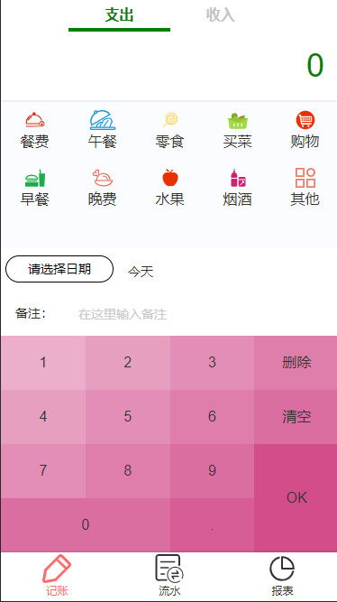
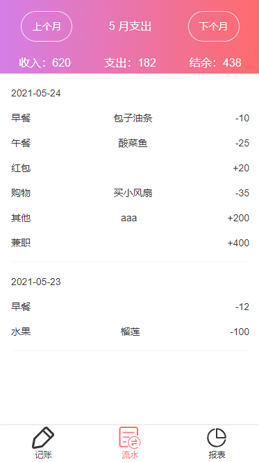
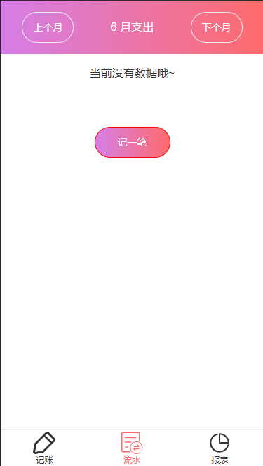
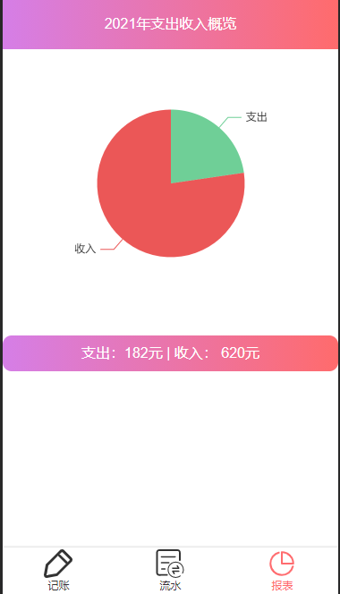
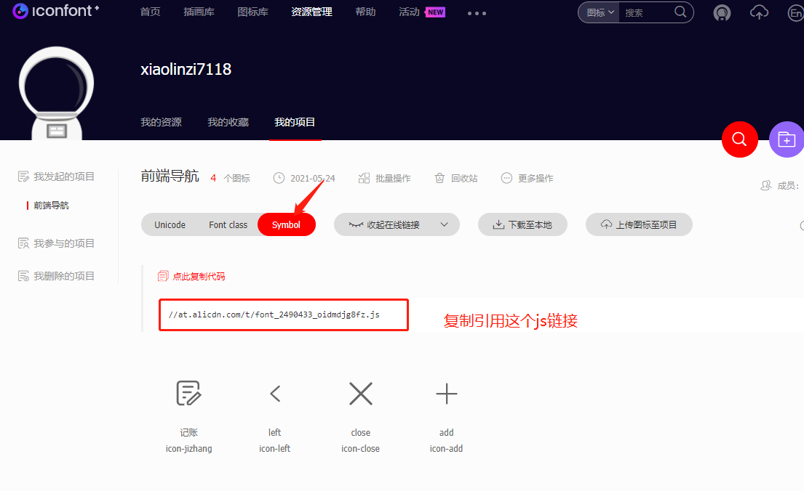
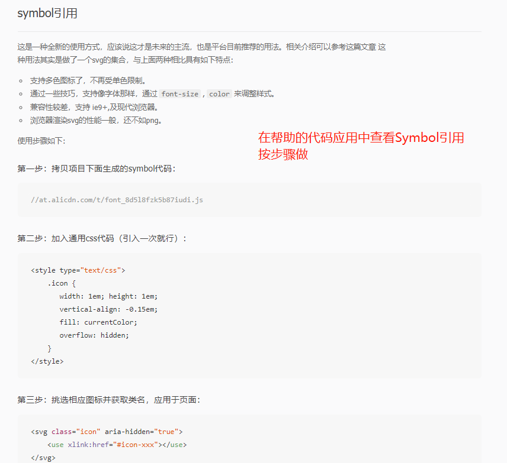
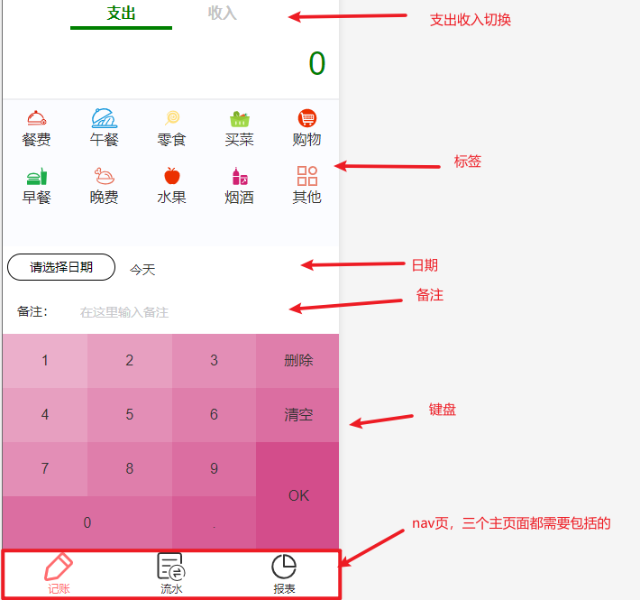

基于这些天用Vue做的一个模仿微信轻记账项目 [预览](https://xiaolinzi7118.github.io/vue-money/#/money) 的总结（小技巧，猜的坑）以及待优化内容。

React版 [预览](https://xiaolinzi7118.github.io/react-money-website/)

## 开始

确保node.js以及@vue/cli全局安装了

用vue创建项目`vue create ...`配置自行选择，然后 `yarn serve`开启端口预览，成功就可以开始干活了。

确定项目的几个页面大致设计样式，三大页面：记账主界面，明细和报表。









## 引入SVG

用了很多从阿里的下载的icon，引入方式有三种（此项目用的第三种）：

### 第一种

引入单个icon，直接复制对应的SVG代码到页面中即可（代码很长且只能单个，项目上不推荐）。

### 第二种

添加到项目，Symbol引用：





### 第三种 svg Symbol方式

选择你想要的icon，直接点击svg下载，批量下载后，新建个文件放到项目src目录下，下面就是介绍怎么可以方便引用对应名字的icon。

在Vue项目中使用需要先安装svg-sprite-loader

```
npm install svg-sprite-loader -D
或
yarn add --dev svg-sprite-loader -D
```

在根目录找一个以.d.ts文件里添加以下代码：

```
declare module "*.svg"{
 const content: string;
 export default content;
}
```

在根目录找一个vue.config.js文件（没有的话就自己建一个），复制以下代码

```
const path = require('path')

module.exports = {
    lintOnSave: false,
    publicPath: '/vue-money/',
    chainWebpack: config => {
        const dir = path.resolve(__dirname, 'src/assets/icons')

        config.module
            .rule('svg-sprite')
            .test(/\.svg$/)
            .include.add(dir).end() // 包含 icons 目录
            .use('svg-sprite-loader').loader('svg-sprite-loader').options({extract: false}).end()
        // .use('svgo-loader').loader('svgo-loader')
        // .tap(options => ({...options, plugins: [{removeAttrs: {attrs: 'fill'}}]})).end()
        config.plugin('svg-sprite').use(require('svg-sprite-loader/plugin'), [{plainSprite: true}])
        config.module.rule('svg').exclude.add(dir) // 其他 svg loader 排除 icons 目录
    }
}
```

**tips:**如果require这个关键词eslint报错了，根据报错提示把`'@typescript-eslint/no-var-requires': 0,`加到.eslintrc.js文件中的rules里即可。

新建一个Icon.vue组件，然后全局引用这个组件

```
<template>
  <svg class="icon" @click="$emit('click',$event)">
    <use :xlink:href="'#'+name"/>
  </svg>
</template>

<script>
// let importAll = (requireContext: __WebpackModuleApi.RequireContext) => requireContext.keys().forEach(requireContext);
// try {
//   importAll(require.context('../assets/icons', true, /\.svg$/));
// } catch (error) {
//   console.log(error);
// }
// __WebpackModuleApi会报错
let importAll = (requireContext) => requireContext.keys().forEach(requireContext);
try {
  importAll(require.context('../assets/icons', true, /\.svg$/));
} catch (error) {
  console.log(error);
}
export default {
  props: ['name'],
  name: "Icon"
}
</script>

<style scoped>
.icon {
  width: 1em;
  height: 1em;
  vertical-align: -0.15em;
  fill: currentColor;
  overflow: hidden;
}
</style>
```

之后每次使用就只需要写

```
<Icon name="id" />
//id为对应icon的文件名
```

**tips:**如果icon自带颜色，手动删除里面的fill属性即可。

## 确定页面渲染顺序走向

1. main.ts：=>App.vue=>router=>分三个大页面：（Money，Detail，reportForm）

2. Money：=> Layout：（=>slot占位插槽内容+Nav：三大页面）

   占位插槽内容：tabs支出收入，Tags标签，日期选择，formItem备注，numberpad键盘

   比如：

   

3. Labels：=> Layout：（=>slot占位插槽内容+Nav：三大页面）

   占位插槽内容：Tags标签列表=>编辑标签页：标签名+删除标签，新增标签

4. reportForm：=> Layout：（=>slot占位插槽内容+Nav：三大页面）

   占位插槽内容：tabs支出收入，计算列表

## 踩得坑

### 全局数据管理

做第一个money页面时没有想到把记账数据放到Vuex上，方便后面两个页面的使用。数据都是在money和几个子组件间通信的，十分琐碎。

抽离出需要后面统计的数据，关于数据的操作都在Vuex里实现。

**input框会记住历史内容并提示：**这个体验不是很好，把name属性删除就可以了。

## 小技巧

* 因为主要应用于手机端，选择日期和列表渲染上面用了**Vant-ui框架**，[官网](https://vant-contrib.gitee.io/vant/#/zh-CN/home)

* 报表的饼图**使用Echarts图表库**
* 用workflows快速部署Vue项目，[使用指南](https://github.com/Jsmond2016/github-action-test)

## 项目待优化

- [ ] 可添加编辑标签页
- [ ] 可以删除或者编辑以往的记录
- [ ] 目前是用LocalStorage存放数据，对于数据的大小有限制，可以存到数据库里，这样可添加用户登录注册
